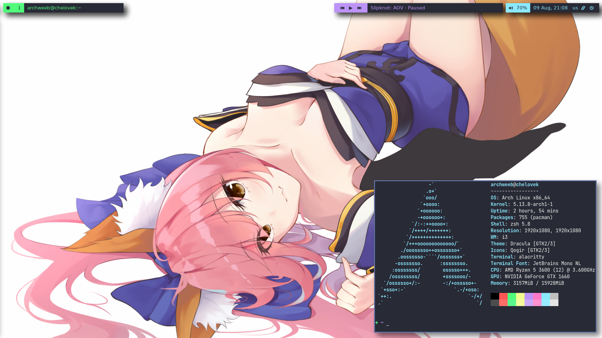

# arch-config

### My i3, polybar, alacritty configs

Screenshot:

### Requires

- playerctl - for spoify player block
- rofi-power-menu
- oh-my-zsh
- Dracula theme for oh-my-zsh
- Fonts:
  - Noto Sans
  - Font Awesome 5
  - IPA Gothic
